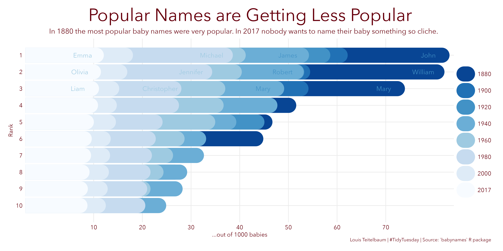

My \#TidyTuesday contributions
================

\#TidyTuesday is a data visualization weekly challenge. Every week, the organizers post a raw dataset and challenge the community to tell a story with it.

[Find out
more](https://github.com/rfordatascience/tidytuesday/blob/master/README.md)

## 2023-04 - Time Zones

## 2022-12 - Baby Names

